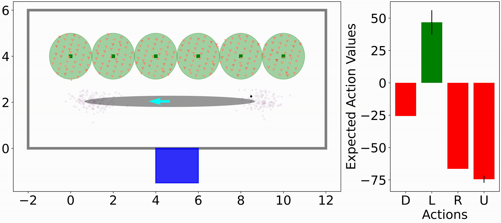

# Simplifying Complex Observation Models in Continuous POMDP Planning with Probabilistic Guarantees and Practice #

This is the python code for titled paper published at the proceedings of AAAI-24, in which we analyze and provide probabilistic guarantees for simplifying observation models in POMDP planning.

[Official paper](https://ojs.aaai.org/index.php/AAAI/article/view/29997)

[Full version with supplementary](https://arxiv.org/abs/2311.07745)

# Citation #

We kindly ask to cite our paper if you find this code useful.

- Lev-Yehudi, I., Barenboim, M., & Indelman, V. (2024). Simplifying Complex Observation Models in Continuous POMDP Planning with Probabilistic Guarantees and Practice. Proceedings of the AAAI Conference on Artificial Intelligence, 38(18), 20176-20184. https://doi.org/10.1609/aaai.v38i18.29997

```
@inproceedings{LevYehudi24aaai,
  title={Simplifying Complex Observation Models in Continuous POMDP Planning with Probabilistic Guarantees and Practice}, 
	volume={38}, 
	url={https://ojs.aaai.org/index.php/AAAI/article/view/29997}, 
	DOI={10.1609/aaai.v38i18.29997},
	number={18}, 
	journal={Proceedings of the AAAI Conference on Artificial Intelligence}, 
	author={Lev-Yehudi, Idan and Barenboim, Moran and Indelman, Vadim}, 
	year={2024}, 
	month={Mar.}, 
	pages={20176-20184}
}
```

# File Description #

- environment.yml - environment file for conda.
- src/beacons_pomdp_test.py - Main script for running scenarios with either original or simplified models.
- src/beacons_test.py - Used to test only the environment.
- src/mes_simp_test.py - Used to test the measurement simplification, calculation of Delta_Z and m_i.
- src/bounds_analyzer.py - Used to generate figures in paper.

# Environment Demonstration #

